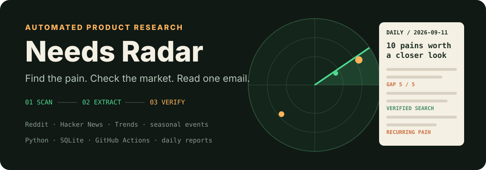

<p align="center">
  
</p>

**Productidea** is the workspace around [Needs Radar](./needs-radar/): a scheduled research pipeline that scans English-language communities for concrete pain points, checks whether competing tools already occupy the search results, and emails a concise Chinese-language opportunity report.

It is not a dashboard or a SaaS app. Its interface is the daily email; GitHub Actions is the runtime.

## Today’s signal, in five minutes

The live pipeline currently:

1. Collects targeted Reddit RSS, phrase-based Reddit search, Hacker News, Google Trends, and a hand-maintained event calendar.
2. Applies recency, engagement, and SQLite deduplication rules.
3. Uses an LLM to extract a specific pain, audience, evidence, and small product shape.
4. Searches the suggested keywords to count real competitors.
5. Scores buildability, monetization, and market gap using those search results.
6. Marks recurring pain found within 90 days.
7. Writes [`reports/YYYY-MM-DD.md`](./needs-radar/reports/) and sends the same shortlist by email.

The competition check is the core guardrail. A plausible idea can look empty to an LLM while the first search page already contains many dedicated tools and official calculators; Needs Radar makes that evidence visible before assigning a gap score.

## Run the offline self-test

```bash
cd needs-radar
python3 -m venv .venv
.venv/bin/pip install -r requirements.txt
.venv/bin/python radar.py --selftest
```

This exercises the rendering path without network access, API spend, email, or changes to the tracked seen database.

For live modes, copy [`.env.example`](./needs-radar/.env.example) and read the complete [Needs Radar guide](./needs-radar/README.md):

```bash
.venv/bin/python radar.py --no-llm   # collect and prefilter only
.venv/bin/python radar.py --dry-run  # full analysis, write report, do not email
.venv/bin/python radar.py            # full scheduled behavior
```

## Workspace map

| Path | Purpose | Status |
| --- | --- | --- |
| [`needs-radar/`](./needs-radar/) | Python batch pipeline, configuration, database, and daily reports | Active; scheduled daily |
| [`PRD-需求雷达.md`](./PRD-需求雷达.md) | Frozen original product definition and rationale | Reference |
| [`english-hot-api/`](./english-hot-api/) | Separate Hono / Vercel news aggregation experiment | Dormant |

`english-hot-api` is not a dependency of Needs Radar. Its anonymous Reddit JSON route is currently broken because that endpoint returns 403; the active radar uses RSS and search APIs instead. The implementations should remain separate unless the dormant API is deliberately revived.

## Configuration and cost controls

[`needs-radar/config.yaml`](./needs-radar/config.yaml) defines sources, thresholds, model batch size, report length, email settings, and maximum daily search count. [`events.yaml`](./needs-radar/events.yaml) records predictable windows such as application, tax, and shopping seasons.

Live operation needs Anthropic and Resend keys. Serper is recommended for phrase search and competitor checks, with SerpAPI as a fallback. Reddit OAuth is optional.

The current configuration uses roughly seven model calls, up to about 45 search calls, one email, and around eight GitHub Actions minutes per day. Those are observed operating figures, not a service guarantee.

## Automation note

[`.github/workflows/daily.yml`](./.github/workflows/daily.yml) runs at 06:00 UTC and commits the new report plus deduplication database back to `main`. Scheduled GitHub jobs may start later than their nominal time.

Because the bot changes `main` every day, pull with rebase before local development:

```bash
git pull --rebase
```

See [`needs-radar/HANDOFF.md`](./needs-radar/HANDOFF.md) for operational decisions and known limitations.
